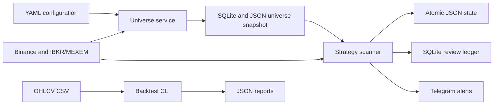

# Trading Alerts

A Python market-research and alerting service that turns configurable technical-analysis rules into repeatable scans, backtests, persistent operational state, and human-review workflows.

The system is designed as decision support, not as an autonomous trading system: it produces deduplicated Telegram alerts for human review, never places orders, and makes no profitability claims.

## Why This Project

Market-data systems are a useful backend engineering problem: data is incomplete or delayed, external providers fail, duplicate events are costly, and a long-running process must recover safely after interruption. This project explores those concerns through a configurable multi-timeframe scanner for crypto and equities.

## Architecture



## Engineering Highlights

- **Separate responsibilities:** independent universe-refresh and strategy-scanning services, plus dedicated backtest and review CLIs.
- **Provider normalization:** Binance and IBKR/MEXEM market data are normalized into a provider-agnostic OHLCV shape before evaluation.
- **Safe long-running behavior:** state snapshots are written atomically, alerts are locally deduplicated once per candle, and a stale or failed universe refresh retains the last valid snapshot rather than publishing a narrowed result.
- **Bounded external work:** configurable request budgets, completed-bar cadence, and prioritization of overdue or promising symbol/timeframe pairs help stay within broker pacing limits.
- **Reviewable decisions:** emitted alerts retain signal evidence in a local SQLite ledger before notification, allowing later manual classification and quality reporting.
- **Reproducible research:** local CSV backtests report generated signals, outcomes, unresolved trades, and the effect of configurable adverse slippage.
- **Containerized operation:** Docker Compose runs the universe and scanning services with shared runtime state and restart policies.

## Quick Start

```bash
python -m pip install -e ".[dev]"
cp .env.example .env
```

Configure the provider and Telegram values in `.env` and `config/live-data.yaml`, then run a single universe refresh and scan:

```bash
trading-universe --once
trading-bot --once
```

Run the long-lived services through Docker Compose when IB Gateway or TWS is available on the host:

```bash
docker compose up --build -d
```

## Validation

```bash
pytest
```

Tests cover configuration defaults, candle confirmation, strategy/backtest behavior, scan planning, state recovery, universe refresh behavior, and alert review persistence.

## Scope and Limitations

- Research and alerting only; this project does not place trades or provide financial advice.
- Strategy rules are configurable approximations of discretionary technical-analysis concepts, not investment recommendations.
- Backtests model closed-candle entries and configurable slippage, but do not model commissions, partial exits, stop adjustments, overlapping positions, or portfolio allocation.

## Detailed Documentation

This project scans a configurable watchlist for three strategy families:

- Break-in: trend pullback into support or resistance with a qualifying master candle.
- Break-out: trend continuation through a corrective trendline break.
- Bollinger reversion: mean-reversion setup around a 100-period Bollinger Band.

The bot is built as an alerting system, not broker execution. It computes candidate setups across multiple timeframes and sends Telegram messages only once per candle.

## What is implemented

- Multi-timeframe scanning for 1 hour, 2 hour, 4 hour, daily, weekly, and monthly bars.
- Provider-aware watchlist entries, so different assets can use different data feeds.
- In-progress provider bars are dropped before strategy evaluation, so master candles must be closed before alerts can fire.
- An IBKR config in `config/live-data.yaml` with explicit Gateway and TWS profiles for live and paper sessions, plus Binance.
- Named symbol lists in `config/live-data.yaml` so intraday scans can be managed independently from the full watchlist.
- Excel-aligned risk, stop, target, and checkpoint management guidance per signal.
- Position size estimate using current IBKR `BuyingPower`, the Excel R/R risk table, and a position-value cap. It does not use total account equity, cash balance, or residual available funds.
- IBKR stock candles use regular trading hours by default (`useRTH: true`), matching a TWS chart with **Use RTH** enabled. Set `use_rth: false` on a specific watchlist instrument only when extended-hours candles are intentional.
- Dynamic U.S. stock scans are limited to IBKR `COMMON` shares. This excludes ETFs, ETNs, and funds that can be unavailable to EU retail accounts because they lack a local KID. IBKR/MEXEM remains the final authority for a particular account, country, and product.
- Telegram notifications with local deduplication in `data/state.json`.

## Data providers

The scanner now supports a normalized multi-provider data layer:

- Binance for crypto candlesticks via the public kline API.
- Interactive Brokers or MEXEM via TWS or IB Gateway for broker-aligned live candles.

The strategy engine in `src/trading_bot/patterns.py` is provider-agnostic. Each provider is normalized into the same OHLCV shape before pattern logic runs.

## Dynamic Universe

The bot runs as two independent services:

- `trading-universe` refreshes a bounded candidate universe. It combines `universe.core_symbols` with configured IBKR scanner results and writes the resolved IBKR contracts to `data/universe.db`.
- `trading-bot` reads that SQLite snapshot and evaluates only those contracts. Until the first successful refresh, or after the snapshot expires, it safely falls back to the configured core symbols.

The default `universe` configuration keeps the macro core instruments and takes up to 75 candidates through a multi-timeframe trend qualification. It prioritizes 50 liquid individual shares from `universe.watchlist_candidates`, then considers up to 25 scanner discoveries. One five-year daily-history request is resampled locally into daily, weekly, and monthly closes. Weekly and monthly 20/50 EMAs must agree, have at least 1% separation, and both be rising (bullish) or falling (bearish) over five bars. Daily trend may align with that macro regime, be a countertrend pullback, or be a neutral EMA compression, preserving break-in candidates near support or resistance. The snapshot records the agreed weekly/monthly direction, its minimum EMA separation, and the daily context. The macro core is deliberately exempt from this candidate gate; watchlist candidates are not. If Gateway interruption prevents at least 80% of candidates from being qualified, the service retains the prior qualified snapshot instead of publishing a narrowed replacement.

The scanner combines `MOST_ACTIVE`, `HOT_BY_VOLUME`, `TOP_PERC_GAIN`, and `TOP_PERC_LOSE` IBKR scanners, keeps a $10 price floor, and removes duplicate resolved contracts. Its `snapshot_max_age_seconds: 21600` is deliberately longer than the four-hour refresh interval, so a missed refresh does not immediately shrink the universe while stale candidates cannot persist indefinitely. A refresh retries one disconnected scanner request and retains the last valid snapshot when every enabled source fails. Scanner results retain the IBKR-resolved exchange, primary exchange, currency, source priority, scanner rank, and trend classification so the strategy process does not need to guess contract routing. The live config assigns the strongest priority to percent movers, then unusual volume, then general activity. The two services use distinct IBKR client IDs: the strategy scanner uses `data_source.providers.ibkr.client_id`, while the universe service uses `universe.client_id`.

Run the universe refresh before the strategy scanner and periodically thereafter:

```bash
trading-universe --once
trading-universe --interval-seconds 14400
trading-bot --once
trading-bot
```

Discovery fetches only the daily history needed to qualify the bounded candidate set, then resamples it locally for weekly and monthly trend checks; it does not evaluate patterns or send Telegram alerts. The strategy scanner has a separate bounded historical request budget per cycle and persists the last successful fetch for each symbol/timeframe in `data/state.json`. It prioritizes overdue core symbols and then the oldest dynamic candidates, while only refreshing a timeframe at its configured completed-bar cadence. Within equally due candidates, it first favors the highest fraction of satisfied pattern-diagnostic checks from the last confirmed frame, then confirmed strong 1-hour trends using directional 20/50 EMA alignment, 20-bar return, EMA separation, and relative volume. This lets the broad universe rotate continuously without exceeding IBKR historical-data pacing.

Browse the current published hot-instrument snapshot without sending any IBKR requests:

```bash
trading-universe --list --limit 50
trading-universe --list --source us_top_percent_gainers
```

The output includes each symbol's discovery source, source priority, IBKR scanner rank, and daily trend classification. Every universe refresh also writes the same list atomically to `data/universe.json`. The service refreshes its snapshot every four hours by default; the displayed list is the latest published snapshot, not a continuous quote feed.

## Backtesting

`trading-backtest` replays the same strategy functions against one local OHLCV CSV at a time. This keeps experiments reproducible and avoids adding high-volume historical requests to IBKR. The CSV must contain a date, datetime, timestamp, or time column plus `open`, `high`, `low`, `close`, and `volume` columns.

```bash
trading-backtest \
	--csv data/history/PATH_1wk.csv \
	--symbol PATH \
	--timeframe 1wk \
	--slippage-bps 5 \
	--output data/backtests/PATH_1wk.json
```

The report includes every generated signal, target/stop outcome, win rate, total realized $R$, and unresolved trades. It assumes entry at the closed signal candle's close, uses the signal's final target, and conservatively records a stop when both target and stop occur in the same future bar. `--slippage-bps` applies adverse slippage to every entry and exit; it defaults to `0` for ideal-fill replay. It does not model commissions, partial exits, stop adjustments, overlapping positions, or portfolio-level allocation.

## Alert Review

Every newly emitted alert is recorded in `data/alert-reviews.db` before Telegram delivery. Each record preserves the signal plan, the exact signal candle, its 20-bar volume ratio, relevant chart levels and trendlines, and Fib data when applicable. This separates the decision review from moving live charts.

List pending records or classify one after reviewing its chart:

```bash
trading-review --status pending
trading-review --record "PATH|1wk|break_in|short|2026-07-10T00:00:00+00:00" --outcome rejected --note "Green doji crossed resistance; no bearish rejection."
```

Valid review outcomes are `accepted`, `rejected`, and `ambiguous`. The ledger is local-only and does not alter strategy behavior or resend alerts.

Summarize manual review quality by pattern, timeframe, asset class, discovery source, and direction:

```bash
trading-review --report
```

This report measures the manual acceptance rate of assessed alerts; it is not a realized-P&L or expectancy report. Those require future-bar settlement or actual fill data.

## Docker Compose

With IB Gateway or TWS running on this Mac, create `.env` from `.env.example`, set the Telegram values, then start both long-running services with one command:

```bash
docker compose up --build -d
```

Compose connects to the host IB Gateway instance through `host.docker.internal`, shares `data/` between services for the universe snapshot, alert state, logs, and charts, and restarts either service unless it is explicitly stopped. Follow the combined logs with `docker compose logs -f`, or stop both services with `docker compose down`.

## Important caveat

The screenshots describe the strategy conceptually. They do not define exact algorithmic rules for trendline construction, support and resistance detection, or the proprietary filter shown in the Bollinger setup. This implementation therefore uses explicit, configurable approximations:

- Trend is approximated with EMA alignment.
- Support and resistance are approximated with rolling highs and lows.
- Break-out confirmation is approximated with a close beyond a corrective trendline built from recent pivot highs or lows.
- Trade management is advisory only: alerts include the Excel Target 1 checkpoint and suggested stop adjustment, but the bot does not manage live positions.
- The Bollinger filter is approximated with momentum over a configurable lookback.

If you want stricter fidelity, the next step is to formalize the remaining discretionary rules and swap out the approximations in `src/trading_bot/patterns.py`.

## Setup

1. Create a `.env` file from `.env.example` and insert your Telegram bot token and chat id.
2. Review `config/live-data.yaml` and adjust the watchlist, providers, timeframes, and risk parameters.
3. Install the project in editable mode.
4. Run a single scan or keep it running continuously.

The top-level IBKR block in `config/live-data.yaml` defaults to IB Gateway ports: `4001` for live and `4002` for paper. Running without `--account-mode` therefore uses IB Gateway.

For explicit session selection, use one of the named profiles under `data_source.providers.ibkr.profiles`:

- `live_gateway`
- `paper_gateway`
- `live_tws`
- `paper_tws`

The shorter aliases select IB Gateway:

- `--account-mode live` maps to `live_gateway`
- `--account-mode paper` maps to `paper_gateway`

Use `--account-mode live_tws` or `--account-mode paper_tws` only when TWS is intentionally required.

Adjust the host and ports in those profile entries so they match your local TWS or IB Gateway configuration.

The live config separates the contract `watchlist` catalog from named `symbol_lists`. Each scan fetches the due subset of active-universe symbol/timeframe pairs, then reuses those frames during pattern evaluation. `app.historical_request_budget` caps requests per cycle and `app.timeframe_refresh_seconds` defines each completed-bar refresh cadence. A pattern's `symbol_list`, such as `bollinger_reversion: intraday_focus`, limits that pattern's evaluation and alerts rather than its data fetches. The scan log reports the planned request count, returned frames, empty responses, and failures so unavailable symbols are visible.

For IBKR futures, the config can now stay at the root symbol level, for example `ES` or `NQ`. When `data_source.providers.ibkr.auto_roll_futures: true` is enabled, the provider resolves the active contract month automatically and prefers contracts with at least `min_days_to_expiry` days left. You can still force a specific contract by setting `last_trade_date_or_contract_month` on an individual watchlist entry.

## Commands

```bash
python -m pip install -e .
trading-bot --once
trading-bot
trading-bot --account-mode live --once
trading-bot --account-mode paper_gateway --once
trading-bot --account-mode live_tws --once
trading-universe --once
trading-backtest --csv data/history/PATH_1wk.csv --symbol PATH --timeframe 1wk
```

Example with an explicit config path:

```bash
trading-bot --config config/live-data.yaml --once
```

## Telegram bot

Create a bot with BotFather, then start a chat with that bot and identify your chat id. The app reads these values from the environment variables in `.env`.

## Suggested next improvements

- Replace the example IBKR symbols with the exact contracts and exchanges you trade.
- Add a scheduler or system service for 24/7 execution.
- Add backtesting so the thresholds can be tuned against historical data.
